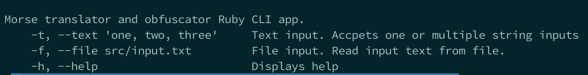

# Ruby Coding Task

The repository is home to the following coding tasks.

* Flatten an Arbitrarily Nested Integer Array
* Morsecode Translator and Obfuscator

Only the Morse code task consist of Ruby files and their respective tests.

The Flatten Array example can easily be achieved with the [Array](https://ruby-doc.org/core-2.4.0/Array.html) Ruby Core class and it's [Array#flatten](https://ruby-doc.org/core-2.4.0/Array.html#method-i-flatten) method.

See the example below.

```ruby
 [1,[2,[3]],4].flatten

 #=> [1, 2, 3, 4]

```

The Morsecode component has 2 additional Ruby files called `translate.rb` and `translate_functions.rb`. Some functions
in `ranslate.rb` where extracted into `translate_functions.rb` to make them testable. `ranslate.rb` is a UNIX style command line application that takes 2 types of input; text and file input

## Getting Started

To get started clone the Github repository on your development machine and refer to the _Installation_ instructions
in this document.

### Prerequisites

* `Ruby 2.4.0` - Please note that I did NOT test in any other version of Ruby

#### RVM

For this project I used RVM to manage the Ruby version and the project gem dependencies.

### Installation

Refer to the [RVM documentation](https://rvm.io/rvm/install) for installation instructions.

Install Ruby version 2.4.0

```bash
rvm install ruby-2.4.0
```
This may take a while. When this is done, we need to tell RVM to use this freshly installed Ruby version and also to create a gemset to manage the project dependencies in an isolated environment.

Create and use the Ruby version and gemset:
```bash
rvm use ruby-2.4.0@coding_task --create
```

Install project dependencies:
```bash
bundle install --binstubs
```

### Running Scripts

The Morsecode Translator and Obfuscator has an additional Ruby script that can be invoked as a shell script. The shell script takes one or more text input arguments or a file path.

Run the script with the `-h` flag to see it's documentation:
```bash
ruby src/translate.rb -h
```

Script output.


To translate an arbitrary amount of input, follow these instructions:

**Plain text input** - For the plain text input.
```bash
ruby src/translate.rb --text 'HELLO','I AM IN TROUBLE'
```

**File input** - For file input, you can add additional lines of plain text to `src/input.txt` if you desired to parse more input.
```bash
ruby src/translate.rb --file src/input.txt
```

Example output.


### Running Tests

#### Overview

The tests for the tasks where written in [RSpec](http://rspec.info/).

#### Flatten an Arbitrarily Nested Integer Array

I did not feel the need to write tests for a Ruby Core class as this would have already been thoroughly tested.

#### Morsecode Translator and Obfuscator

Run the _morse_code_translator_ tests:
```bash
bundle exec rspec --format documentation spec/morse_code_translator_spec.rb
```

Run the _morse_code_obfuscator_ tests:
```bash
bundle exec rspec --format documentation spec/morse_code_obfuscator_spec.rb
```

##### Ruby shell script for Morsecode Translator and Obfuscator

Run the _translate_functions_ tests:
```bash
bundle exec rspec --format documentation spec/translate_functions_spec.rb
```

#### All RSpec tests

Run _all_ tests:
```bash
bundle exec rspec --format documentation
```

## Authors

* **Bjorn Theart**

## License

This project is licensed under the MIT License - see the [LICENSE.md](LICENSE.md) file for details
