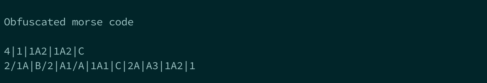

# Ruby Coding Task

The repository is home to the following coding tasks.

* Flatten an arbitrarily nested integer array
* Morsecode translator and obfuscator

> Only the morse code task consist of Ruby files and their respective tests.

The _Flatten an arbitrarily nested integer array_ example can easily be achieved with the [Array](https://ruby-doc.org/core-2.4.0/Array.html) Ruby Core class and it's [Array#flatten](https://ruby-doc.org/core-2.4.0/Array.html#method-i-flatten) method. I did not see the need to reinvent the wheel here :)

See the example below
```ruby
 [1,[2,[3]],4].flatten
 #=> [1, 2, 3, 4]
```

The _Morsecode translator and obfuscator_ component is encapsulated in a module called _MorseCode_.

```ruby
module MorseCode
  class Translator
    ...
  end
  class Obfuscator
    ...
  end
end
```

It has 2 additional Ruby files:
* `cli.rb`
* `cli_helper.rb`

I extracted the `translate_and_obfuscate()` method in `cli.rb` to `cli_helper.rb` to make it testable.

`cli.rb` is a UNIX style command line application that takes 2 types of input:
* `text`
* `file input`

## Getting Started

To get started clone the Github repository on your development machine and refer to the _Installation_ instructions
in this document.

### Prerequisites

* `Ruby 2.4.0` - Please note that I did NOT test in any other version of Ruby

#### RVM

For this project I used RVM to manage the Ruby version and the project gem dependencies.

### Installation

Refer to the [RVM documentation](https://rvm.io/rvm/install) for installation instructions.

Install Ruby version 2.4.0
```bash
rvm install ruby-2.4.0
```
> This may take a while

Let's tell RVM to use the freshly installed Ruby version and also to create a gemset to manage the project dependencies in an isolated environment.

Create and use the Ruby version and gemset
```bash
rvm use ruby-2.4.0@coding_task --create
```

Install Bundler
```bash
gem install bundler
```

Install project dependencies
```bash
bundle install
```

### Running Scripts

Run the _Morsecode translator and obfuscator_ CLI script with the `-h` flag to see it's documentation
```bash
ruby src/cli.rb -h
```

Script output


To translate an arbitrary amount of input, follow these instructions.

**Plain text input**
```bash
ruby src/cli.rb --text 'HELLO', 'I AM IN TROUBLE'
```

**File input**
> You can add additional lines of plain text to `src/input.txt` if you desired to parse more input

```bash
ruby src/cli.rb --file src/input.txt
```

Example output


### Running Tests

#### Overview

The tests for the tasks where written in [RSpec](http://rspec.info/).

> There are no test for the _Flatten an arbitrarily nested integer array_. I did not feel the need to write tests for a Ruby Core class as this would have already been thoroughly tested by it's maintainers

#### Morsecode Translator and Obfuscator

Run the `MorseCode::Translator` tests:
```bash
bundle exec rspec --format documentation spec/translator_spec.rb
```

Run the `MorseCode::Obfuscator` tests:
```bash
bundle exec rspec --format documentation spec/obfuscator_spec.rb
```

##### Ruby shell script for Morsecode Translator and Obfuscator

Run the `cli_helper` tests:
```bash
bundle exec rspec --format documentation spec/cli_helper_spec.rb
```

#### All RSpec tests

Run _all_ tests:
```bash
bundle exec rspec --format documentation
```

## Authors

* **Bjorn Theart**

## License

This project is licensed under the MIT License - see the [LICENSE.md](LICENSE.md) file for details
